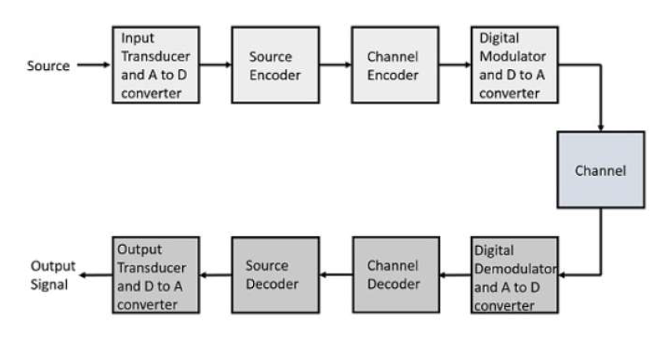

# Digital-Communications-End-to-End

This is the MATLAB implementation of Adaptive Delta Modulation with Duobinary Encoder.

To  see the detailed analysis of the code, see [Report](./report.pdf)
 
See the [Published Code](./Publish.pdf) for compact view.
<hr>

### Introduction to Communication Model

  
```
In this project, we are going to implement a Transmitter-Channel-Receiver Model in
MATLAB and try to reciprocate the noise into the system for practical view of the
system.
We are going to implement Adaptive Delta Modulation Technique and a correlative
coding i.e. Duobinary Signaling.
```
### Structure of code

| Functions    | Description     | 
| :------------- | :----------: |
|  [ad_deltamod.m](./Code/ad_deltamod.m) | ADM Transmitter |
|  [ad_deltamod.m](./Code/ad_deltamod.m)  | ADM Receiver   |
|  [Duobinary_Encoder.m](./Code/Duobinary_Encoder.m) | Duobinary Encoder |
|  [Duobinary_Decoder.m](./Code/Duobinary_Decoder.m) | Duobinary Decoder  |


Runner Files: 
>  [Communication_system.m](./Code/Communication_system.m)

> [Communication_system_duobinary_error.m](./Code/Communication_system_duobinary_error.m)
 

The outputs are detailed into report. Please check!


 
### Acknowledgement
[Adaptive Delta Modulation Techniques](https://research.ijcaonline.org/icedsp/number2/icedsp1016.pdf)
```
Niranjan U
Dept. of E&C
BMS college of Engineering
Bangalore-19

M.N.Suma
Dept. of E&C
BMS college of Engineering
Bangalore-19
```

